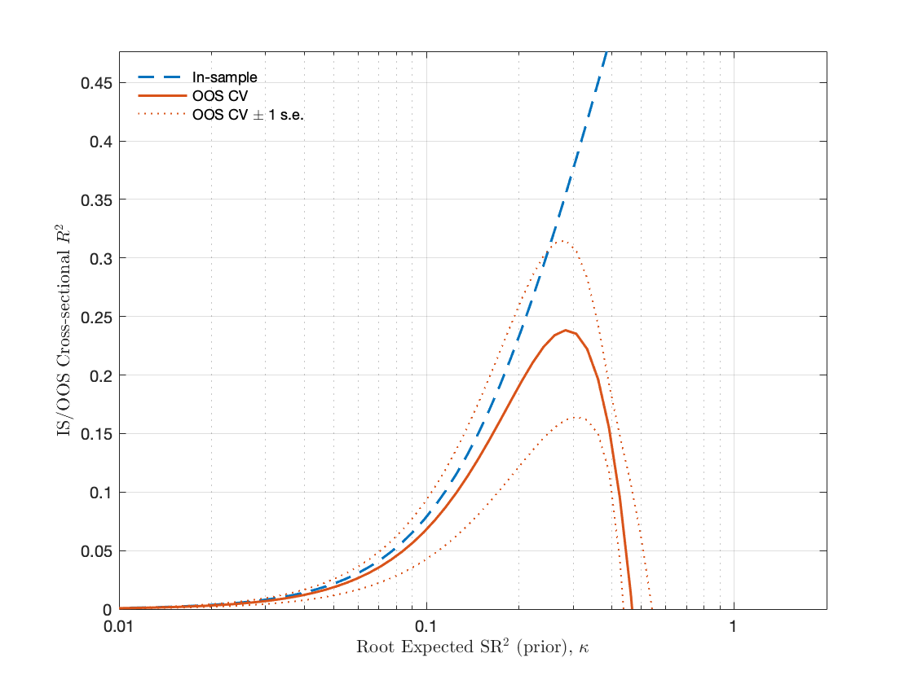
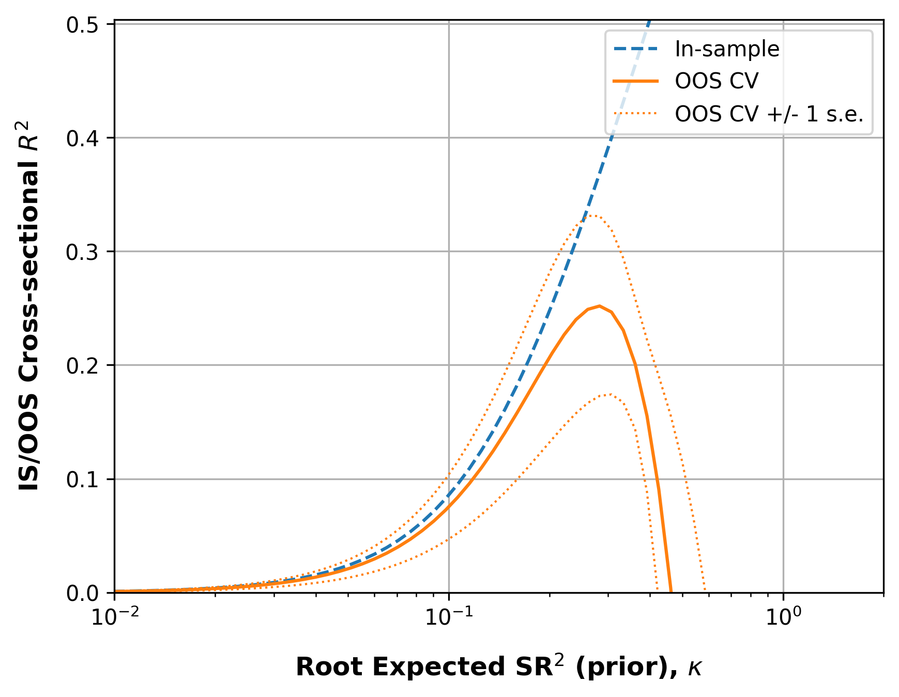
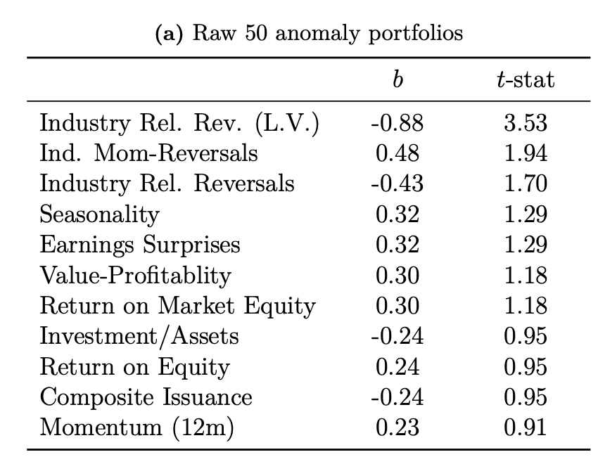
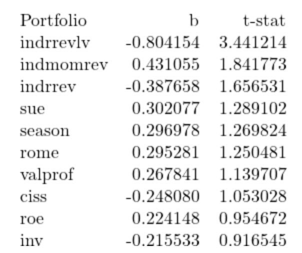
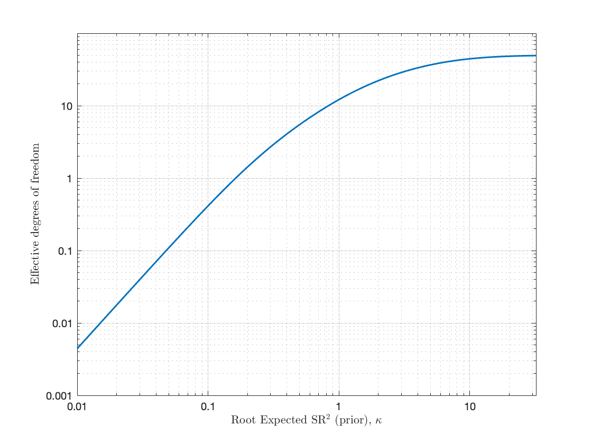
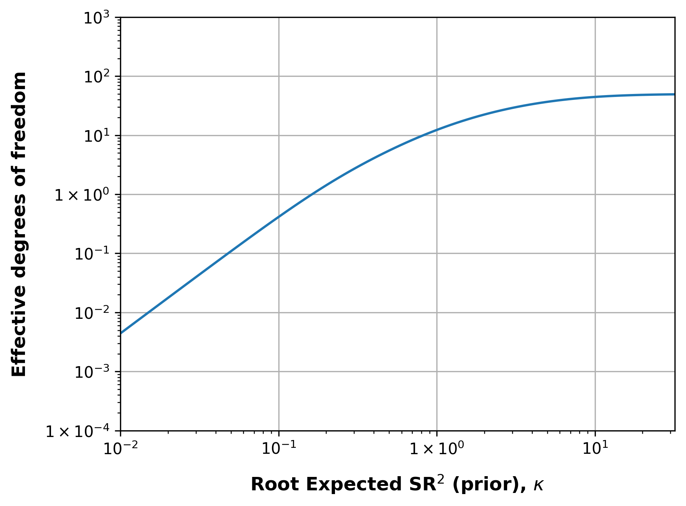
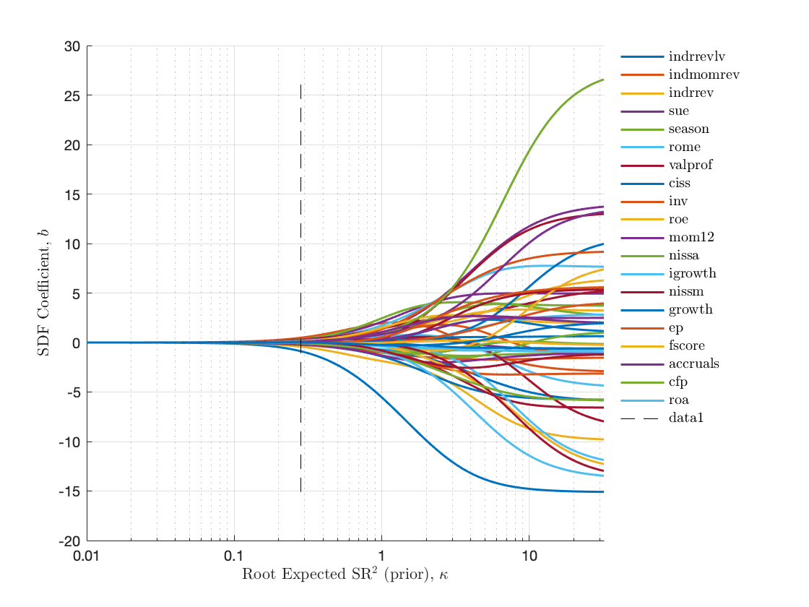
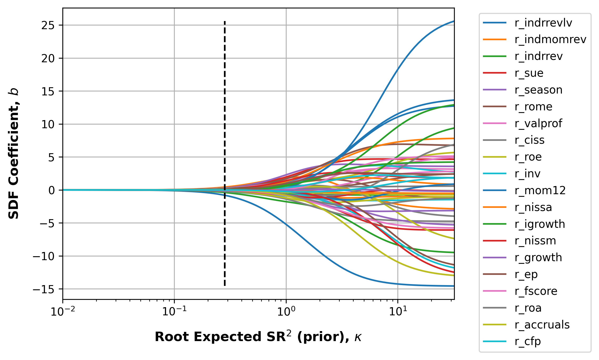
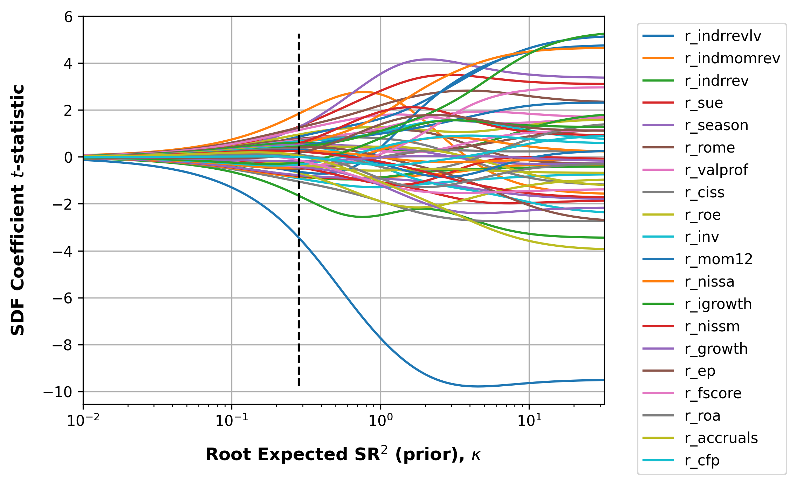

# Replication: Shrinking the Cross-Section

This repository hosts the replication of findings from the paper titled *Shrinking the Cross-Section* by **S. Kozak, S. Nagel, and S. Santosh**, published in the Journal of Financial Economics in 2020. The paper explores the construction of a robust stochastic discount factor (SDF) that encapsulates the collective explanatory power of numerous cross-sectional stock return predictors through an economically substantiated prior on SDF coefficients, providing a robust out-of-sample performance in high-dimensional settings.

[Link to the original paper on SSRN](https://papers.ssrn.com/sol3/papers.cfm?abstract_id=2945663).

## Abstract:
> We construct a robust stochastic discount factor (SDF) that summarizes the joint explanatory power of a large number of cross-sectional stock return predictors. Our method achieves robust out-of-sample performance in this high-dimensional setting by imposing an economically motivated prior on SDF coefficients that shrinks the contributions of low-variance principal components of the candidate factors. While empirical asset pricing research has focused on SDFs with a small number of characteristics-based factors --- e.g., the four- or five-factor models discussed in the recent literature --- we find that such a characteristics-sparse SDF cannot adequately summarize the cross-section of expected stock returns. However, a relatively small number of principal components of the universe of potential characteristics-based factors can approximate the SDF quite well.

## Dataset and Original Code:
For datasets and code, please see [Serhiy Kozak's webpage](https://www.serhiykozak.com/data).

## Repository Structure:
- **scs_main.py**: Run scs_main.py to obtain the replication results.
- **Data**: The dataset referenced in the paper.

# Results
Comparison of original results from the paper and replication results from the Python script, aligned side-by-side for comparison.

## L2 Model Selection
### In-sample and Out-of-Sample Cross-Sectional R^2 Analysis
> This section displays the original and replicated plots that present the in-sample cross-sectional R^2 (dashed line), out-of-sample (OOS) cross-sectional R^2 based on cross-validation (solid line), and OOS cross-sectional R^2 based on the proportional shrinkage (dash-dot line) as per Pástor and Stambaugh (2000).

#### Original

#### Replicated

### Largest SDF factors
> Coefficient estimates and absolute t-statistics at the optimal value of the prior root expected SR2 (based on cross-validation), with focus on the original 50 anomaly portfolios. Coefficients are sorted descending on their absolute t-statistic values.

#### Original

#### Replicated

### Degrees of Freedom
> TODO

#### Original

#### Replicated

## SDF Coefficients

### Coefficient Paths
> TODO

#### Original

#### Replicated

### t-Statistic Paths
> TODO

#### Original

#### Replicated

